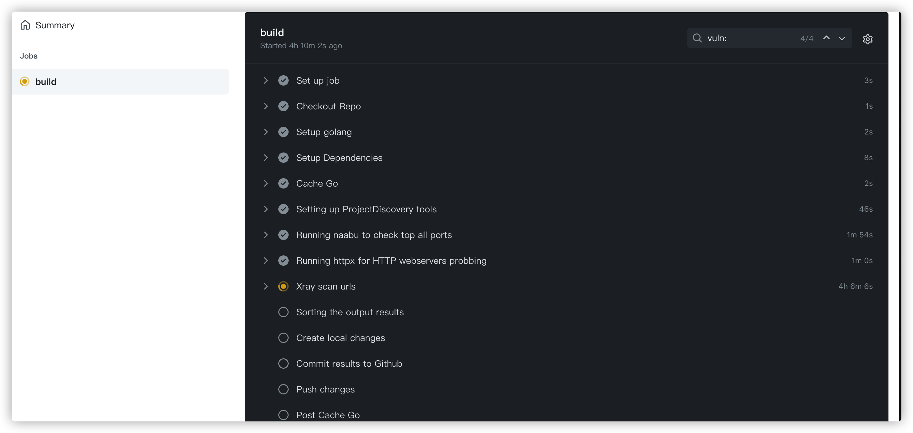
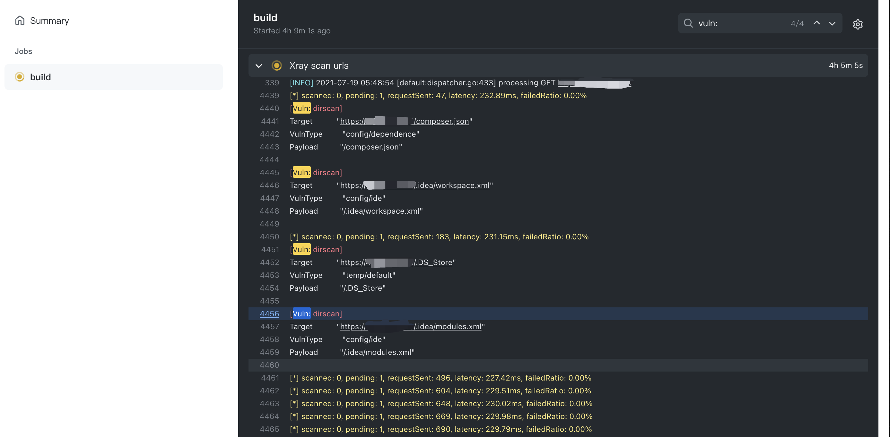
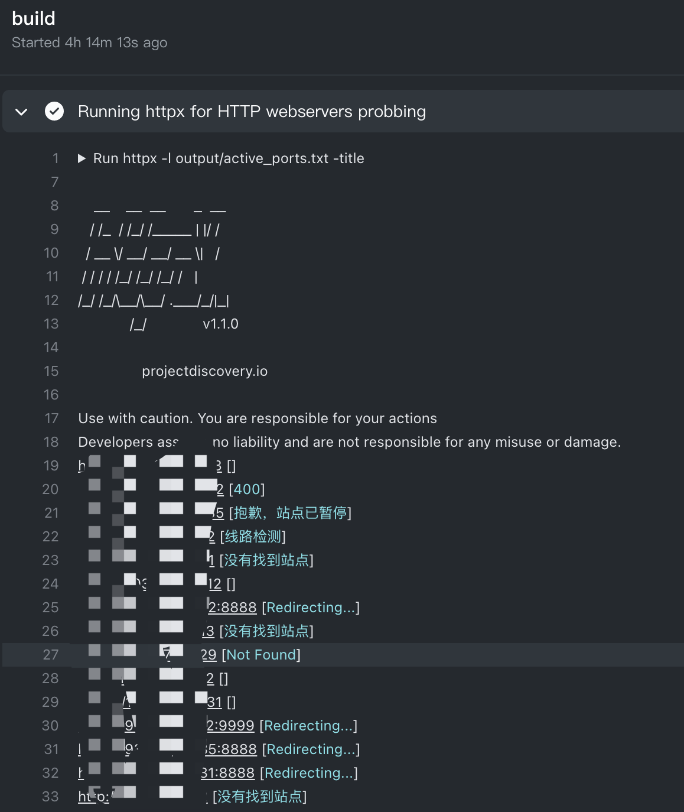
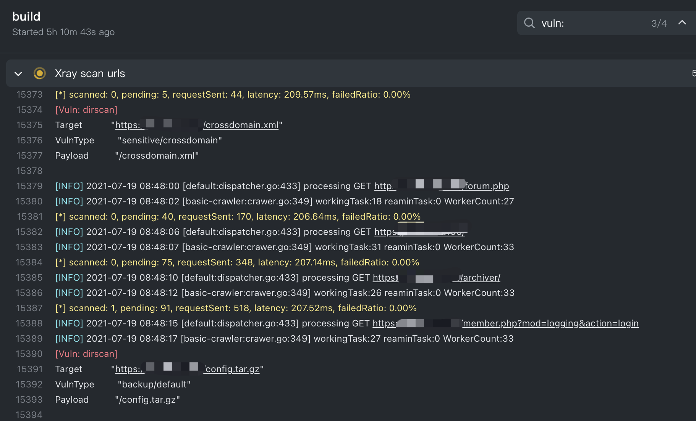

# InCloud GitHub云上扫描器

## 简介
本工具只可用于安全测试，勿用于非法用途！
### 工具定位
运行于GitHub Actions 的仓库中自动化、自定义和执行软件开发工作流程，可以自己根据喜好定制功能，InCloud已经为您定制好了八种针对网段和域名的不同场景的信息收集与漏洞扫描流程。
* [PortScan-AllPort](https://github.com/inbug-team/InCloud/tree/PortScan-AllPort) 对单IP文件列表进行全端口扫描，输出可用Web服务标题。
* [PortScan-AllPort-Xray-Dirscan](https://github.com/inbug-team/InCloud/tree/PortScan-AllPort-Xray-dirscan)   对单IP文件列表进行全端口扫描，输出可用Web服务标题，对Web服务进行Xray爬虫爬取与漏洞扫描，对Web服务进行Ffuf目录递归扫描。
* [PortScan-Top1000](https://github.com/inbug-team/InCloud/tree/PortScan-Top1000) 对单C段IP列表进行Top1000端口扫描，输出可用Web服务标题。
* [PortScan-Top1000-Xray](https://github.com/inbug-team/InCloud/tree/PortScan-Top1000-Xray) 对单C段IP列表进行Top1000端口扫描，输出可用Web服务标题，对Web服务进行Xray爬虫爬取与漏洞扫描。
* [PortScan-Top1000-Dirscan](https://github.com/inbug-team/InCloud/tree/PortScan-Top1000-Dirscan) 对单C段IP列表进行Top1000端口扫描，输出可用Web服务标题，对Web服务进行Ffuf目录递归扫描。
* [SubDomain-Portscan-Vulnscan](https://github.com/inbug-team/InCloud/tree/SubDomain-Portscan-Vulnscan) 对域名进行子域名枚举与接口查询，对查询的子域名进行Top1000端口扫描，输出可用Web服务标题，对Web服务进行Nuclei漏洞扫描。
* [SubDomain-Portscan-Xray](https://github.com/inbug-team/InCloud/tree/SubDomain-Portscan-Xray) 对域名进行子域名枚举与接口查询，对查询的子域名进行Top1000端口扫描，输出可用Web服务标题，对Web服务进行Xray爬虫爬取与漏洞扫描。
* [SubDomain-Portscan-Dirscan](https://github.com/inbug-team/InCloud/tree/SubDomain-Portscan-Dirscan) 对域名进行子域名枚举与接口查询，对查询的子域名进行Top1000端口扫描，输出可用Web服务标题，对Web服务进行Ffuf目录递归扫描。

## 使用方法
* 1.将项目fork到自己的github.
* 2.修改流程文件（.github/workflows/incloud.yaml）里的 git config --local user.email  与   git config --global user.name  改成自己的邮箱与自己的ID（用于报告输出）。
* 3.修改input目录的扫描目标，使用action标签进行在线编译。
* 4.GitHub提供六小时的容器使用时长，扫描结束后，扫描结果会自动上传到自己fork的output文件夹下。
* 
* 
* 
* 
* 
## References
* https://github.com/chaitin/xray
* https://github.com/ffuf/ffuf
* https://github.com/projectdiscovery/nuclei
* https://github.com/projectdiscovery/naabu
* https://github.com/projectdiscovery/nuclei
* https://github.com/projectdiscovery/subfinder

**官网：**
https://www.inbug.org

同时也可通过公众号联系：

